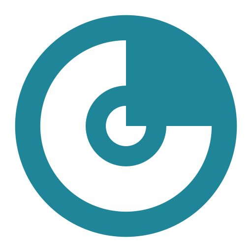
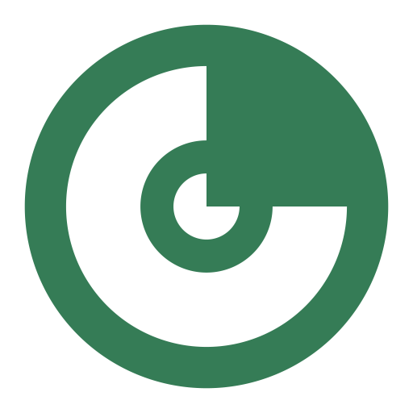
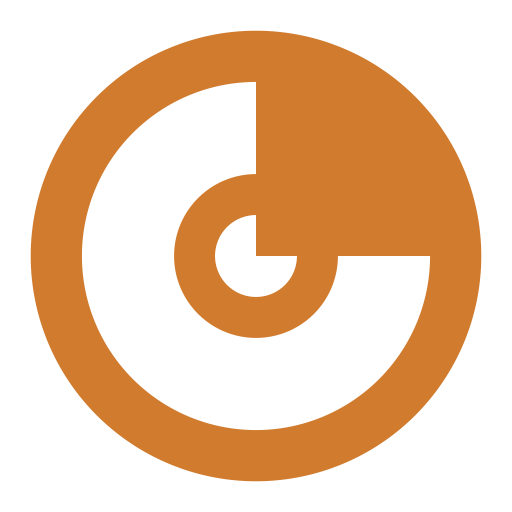

# Nemukai

*A quiet rebellion against loud tech.*

 

Nemus (grove, Latin) meets Kai (ocean, 海). A word born from earth and water, for a studio building technology worth remembering.

We research, design, and engineer products that carry the wonder of the natural world — the richness of a coral reef, the warmth of a coastal sunset, the quiet surprise of something you've never seen before. This isn't minimalism. A reef isn't simple. It's layered, alive, full of things worth noticing. That's the standard.

Home — [**nemukai.com**](https://nemukai.com).

 

## Products

<table>
  <tr>
    <td width="33%" valign="top">
      <h3><a href="https://koe.nemukai.com">Koe</a></h3>
      

      
Voice-first Indic language AI. Transcription, translation, summarization for languages the frontier rarely sees.

    </td>
    <td width="33%" valign="top">
      <h3>HoloHut</h3>
      

      
Pokémon TCG pack stock tracker for India. Auto-updated hourly. No retail runaround.

    </td>
    <td width="33%" valign="top">
      <h3>Cerno</h3>
      

      
Calm desktop app that turns messy spreadsheets into conversational data. Drop Excel in, ask questions.

    </td>
  </tr>
</table>

 

## Principles

**Wonder over polish.** A clean interface is table stakes. What matters is whether someone pauses and thinks *I've never seen this before.*

**Craft is non-negotiable.** Every surface ships finished. No ugly MVPs. No "we'll fix it later."

**Character over convention.** If it could belong to any studio, it doesn't belong to this one.

**Depth over breadth.** Each product solves a single problem completely. A pool is wide and shallow. A reef is focused and infinite.

**Build the floor, not just the room.** The things nobody sees, built with the same ambition as the things everybody does.

 

## The palette

&nbsp;&nbsp;&nbsp;&nbsp;
&nbsp;&nbsp;&nbsp;&nbsp;
&nbsp;&nbsp;&nbsp;&nbsp;

Kai · Nemus · Yūhi · Ink — drawn from a coral reef at different times of day.

 

---

 

 

*Come up for air.*

